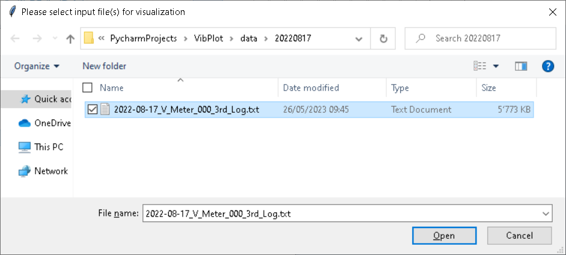
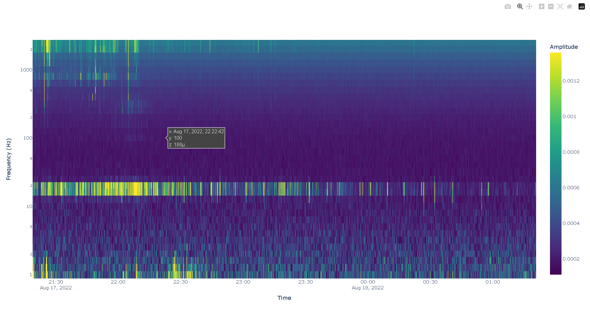
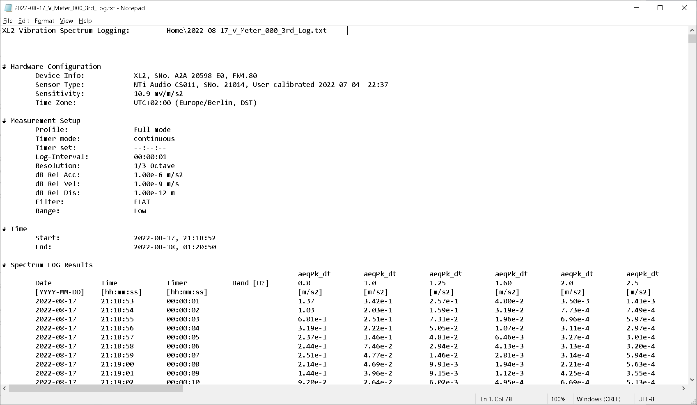

# VibPlot: A Vibrational Frequency Plotting Tool 

VibPlot is a Python application built to generate 2D interactive vibrational frequency plots, also known as spectrograms. The tool takes its input from files created by an [XL2 Audio and Acoustic Analyzer](https://www.nti-audio.com/en/products/sound-level-meters/xl2-audio-acoustic-analyzer). VibPlot efficiently reads time-indexed data of varying vibration intensities across different frequencies and converts this data into visually appealing heatmaps. These heatmaps are interactive, with time on the x-axis, frequency (in Hz) on the y-axis, and the amplitude represented through a color scale. The output is conveniently saved as an HTML file.

## Windows Installation

For quick access, download the latest executable of VibPlot directly from the [Releases page](https://github.com/Martin09/VibPlot/releases). Downloading and running the executable is all it takes to get started with VibPlot.

## Usage

On execution, VibPlot prompts a file dialog box for you to select the input file(s). After you choose the desired file(s) and click 'Open', the program gets to work.

VibPlot processes the selected file(s), creates the respective spectrogram(s), and saves the HTML files in the same directory as the input files.

On completion, a message box pops up to indicate the end of the process.

To view the output files, open them with your browser (Google Chrome recommended). The visualization tool, Plotly, makes the spectrogram interactive, allowing you to zoom in or pan over your data using the tools located in the top right corner of the visualization page.

## Installing from Source

To install VibPlot from the source, clone the repository to your local machine using the following command:

`git clone https://github.com/Martin09/VibPlot.git`

VibPlot requires the following Python packages:

- `numpy`
- `pandas`
- `plotly`
- `tkinter`

### Installation with Poetry

To use Poetry for dependency installation, navigate to the directory of the cloned repository and execute:

`poetry install`

This command creates a virtual environment and installs all dependencies specified in the `pyproject.toml` file.

### Installation with pip

Alternatively, you can use pip to install the necessary dependencies:

`pip install -r requirements.txt`

**Note**: `tkinter` comes pre-installed with standard Python distributions. If it's not included in your distribution, install it separately.

### Building the Executable

Run either "build_onedir.bat" or "build_onefile.bat" batch file to run PyInstaller with the respective `.spec` file, which will create an executable in the `dist/` directory.

## Input File Format

The acceptable input files are CSV files with the following structure:

- Data starts from row 29 (the first 28 rows are ignored)
- The first column represents the 'Date' in the 'YYYY-MM-DD' format
- The second column represents the 'Time' in the 'HH:MM:SS' format
- The subsequent columns hold float values that represent vibration intensity at varying frequencies

Refer to the screenshot below for an example of a raw vibration spectrogram data file:

## Authors

* Martin Friedl

## License

This project is licensed under the MIT License - for more information, refer to the [LICENSE.md](LICENSE.md) file.

## Acknowledgments

* Many thanks to Heinz for the helpful discussions and feedback on this tool. I hope it serves you well! :)

